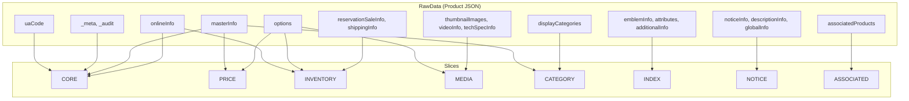
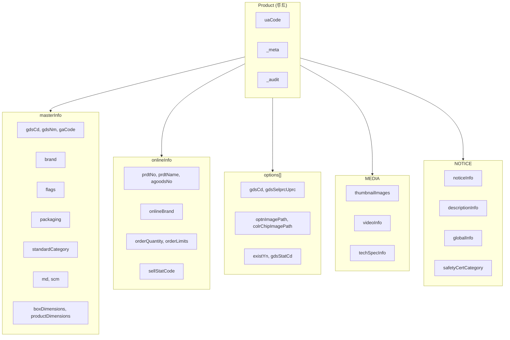
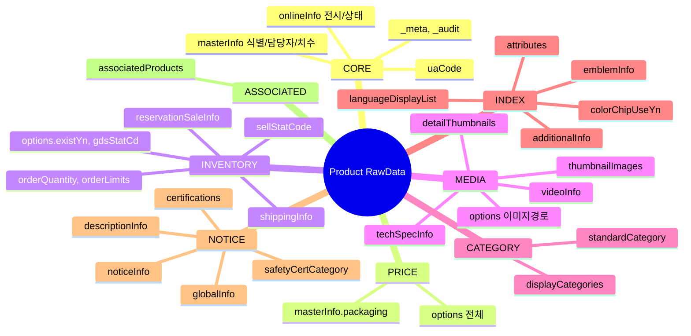
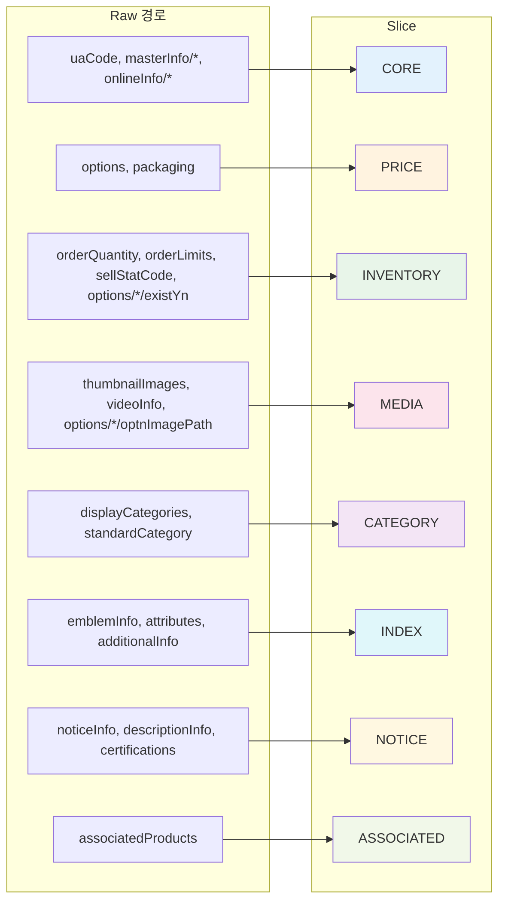
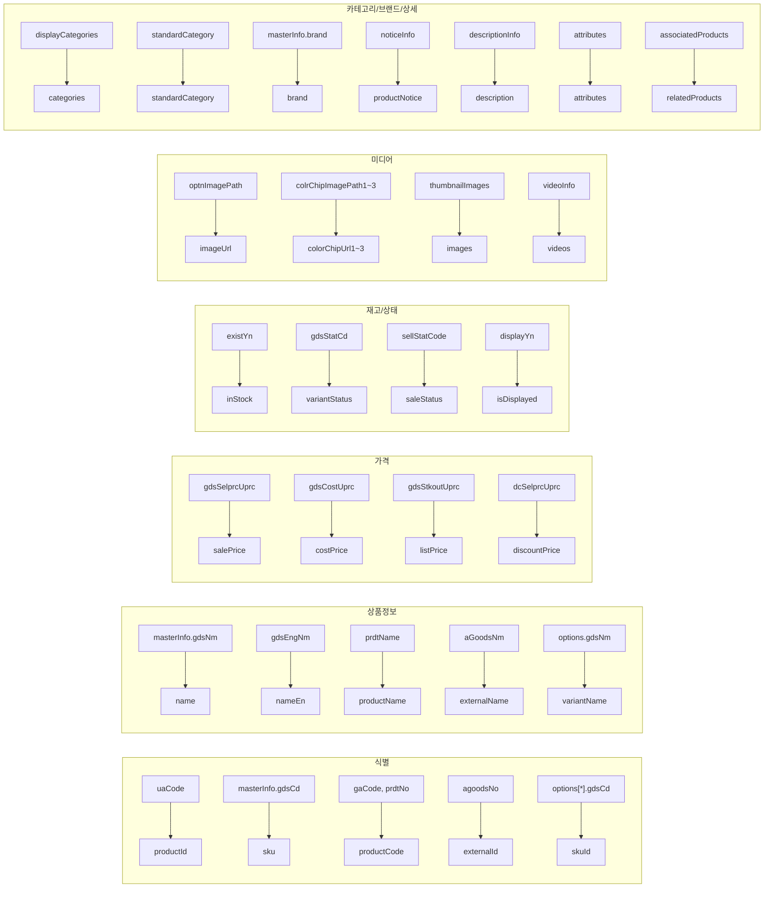
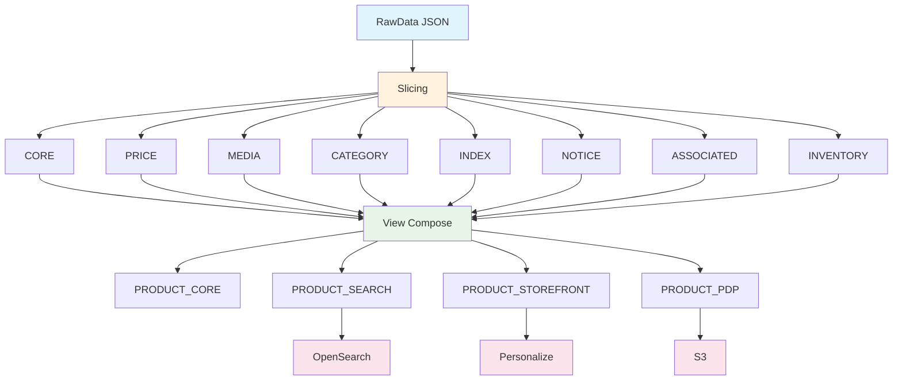

# RFC: Product RawData → IVM-Lite Contract DX 제안

**대표 샘플**: `.tmp/product/UA30953620.json` (309KB, 24개 최상위 키)  
**추가 샘플**: `UA11279226.json` (112KB), `UA10476976.json` (12KB), `UA58610827.json` (142KB, options 9개), `UA99745489.json` (11KB, options 2개) — [1.4 다중 샘플 검증](#14-다중-샘플-검증) 참조  
**목표**: 실제 상품 RawData를 IVM-Lite 스키마/룰셋으로 설계할 때 DX와 성능 극대화

> **최종 매핑표**: [부록 A](#부록-a-최종-매핑표-구현-참조용) — Slice/필드/View/Sink 매핑 일괄 참조  
> **결정 프로세스**: [2.2.1 Slice/View 결정 프로세스](#221-sliceview-결정-프로세스) — 새 도메인 설계 시 Slice/View 어떻게 정할지

---

## 문서 구조 (3층 분리)

이 RFC는 **엔진 확장 필요 여부**로 구분하여, 구현 착수 시 논쟁을 줄인다.

| 구분 | 내용 | 착수 |
|------|------|------|
| **(1) 엔진 확장 없이 가능** | RuleSet, View 4종, productE2E, SinkRule | 즉시 |
| **(2) 작은 확장 필요** | RAW_SCHEMA, 경로 패턴화, View projection | 결정 후 |
| **(3) 엔진 로드맵** | TopoSort 런타임, key-based diff, NOTICE 외부화 | 나중 |

---

## 이번에 잠글 5개

구현 착수 전 **반드시 확정**할 항목.

| # | 항목 | 확정 내용 |
|---|------|-----------|
| 1 | **SliceType** | NOTICE, ASSOCIATED 추가 + view.pdp.requiredSlices에 반영 |
| 2 | **PRODUCT_SEARCH** | requiredSlices = CORE, PRICE, CATEGORY, INDEX (고정) |
| 3 | **impactMap options** | options 충돌 규칙 계약 패턴화 (아래 3.2) |
| 4 | **productE2E** | 샘플 1개로 parse→validate→ingest→view compose→sink dry-run 한 번에 |
| 5 | **RAW_SCHEMA** | Raw 검증용 계약 타입 추가 여부 (A안/B안 중 택1, 아래 2.1) |

---

## SOTA 잠금 8개 (완전 잠금용)

SOTA로 가려면 아래 8개를 **계약/문서로 고정**해야 함.

| # | 잠금 | 내용 |
|---|------|------|
| 1 | **Determinism** | canonical profile, hashAlg, list ordering 단일화 (아래 10.1) |
| 2 | **options 충돌** | impactMap에 /options는 PRICE만. INVENTORY/MEDIA는 /options/*/... 하위 경로만 (아래 3.2) |
| 3 | **NOTICE 크기** | NOTICE_RENDER vs NOTICE_BLOB 정책 (아래 10.2, [3] 로드맵) |
| 4 | **Sink delivery** | idempotency + delivery semantics (아래 10.3) |
| 5 | **Sink 개념** | Sink는 View를 모른다. Slice set + projection만 안다 (아래 10.4) |
| 6 | **RAW_SCHEMA 실패** | 검증 실패 모드 (FAIL_CLOSED vs ACCEPT_WITH_WARN) (아래 10.5) |
| 7 | **네이밍** | 내부 식별자 UPPER_SNAKE, 출력 필드명 camelCase (아래 8.0) |
| 8 | **Sink Payload** | viewData 구조, viewType, projection, entityKey 형식 (아래 10.4.1) |

---

## 1. 샘플 데이터 분석 (UA30953620.json)

### 1.1 최상위 구조

| 키 | 용도 | Slice 후보 |
|----|------|------------|
| `uaCode` | 상품 식별자 (UA + 8자리) | CORE |
| `_meta`, `_audit` | 메타/감사 정보 | CORE |
| `masterInfo` | 마스터 정보 (GTIN, 브랜드, 카테고리, 포장 등) | CORE, PRICE, CATEGORY |
| `onlineInfo` | 온라인 전시/판매 정보 | CORE, INVENTORY |
| `options` | 옵션별 가격/재고 | PRICE, INVENTORY |
| `thumbnailImages`, `videoInfo`, `detailThumbnails`, `techSpecInfo` | 미디어 | MEDIA |
| `displayCategories` | 전시 카테고리 | CATEGORY |
| `emblemInfo`, `attributes`, `colorChipUseYn` | 뱃지/속성/필터 | INDEX |
| `descriptionInfo`, `noticeInfo`, `globalInfo`, `certifications`, `safetyCertCategory` | PDP 상세 (성분·사용법·인증·고지) | NOTICE |
| `additionalInfo` | 검색 키워드 | INDEX |
| `associatedProducts` | 연관 상품 | ASSOCIATED (신규) |
| `shippingInfo`, `reservationSaleInfo` | 배송/예약 | INVENTORY |
| `languageDisplayList` | 다국어 | INDEX |

### 1.2 실제 RawData 필드 구조 (UA30953620.json 검증)

샘플에서 **실제 존재하는** 필드만 정리. (gtin은 없음 → gdsCd 사용)

| 경로 | 타입 | 샘플 존재 | Slice |
|------|------|-----------|-------|
| uaCode | string | ✓ | CORE |
| _meta, _audit | object | ✓ | CORE |
| masterInfo.gdsCd, gdsNm, gdsEngNm | string | ✓ | CORE |
| masterInfo.gaCode, buyTypNm, gdsRegYmd | string | ✓ | CORE |
| masterInfo.brand, flags, supplier, manufacturingCountry, md, scm | object | ✓ | CORE |
| masterInfo.boxDimensions, productDimensions, onyoneSpNm, manBabySpNm | - | ✓ | CORE |
| masterInfo.poutTlmtDdNum, validPrdDdNum, infnSelImpsYnValue | - | ✓ | CORE |
| masterInfo.packaging | object | ✓ | PRICE |
| masterInfo.standardCategory | object | ✓ | CATEGORY |
| masterInfo.gtin | - | ✗ (샘플에 없음) | - |
| onlineInfo.prdtNo, prdtName, agoodsNo, aGoodsNm, onlinePrdtName, prdtSbttlName | string | ✓ | CORE |
| options[*].gdsCd | string | ✓ | PRICE (옵션별 SKU) |
| onlineInfo.prdtStatCode, displayYn, prdtGbnCode, prdtGbnCodeName, prdtStatCodeName, sellStatCodeName | string | ✓ | CORE |
| onlineInfo.saleEndText, appExcluPrdtYn | - | ✓ | CORE |
| onlineInfo.onlineBrand, onlineMd | object | ✓ | CORE |
| onlineInfo.orderQuantity, orderLimits, sellStatCode | - | ✓ | INVENTORY |
| options | array | ✓ | PRICE |
| options[*].gdsSelprcUprc, existYn, gdsStatCd | - | ✓ | PRICE/INVENTORY |
| options[*].optnImagePath, colrChipImagePath1~3 | - | ✓ | MEDIA |
| thumbnailImages, videoInfo, detailThumbnails, techSpecInfo | array/object | ✓ | MEDIA |
| displayCategories | array | ✓ | CATEGORY |
| emblemInfo, attributes, colorChipUseYn, additionalInfo, languageDisplayList | object/array | ✓ | INDEX |
| noticeInfo, descriptionInfo, globalInfo, certifications, safetyCertCategory | object | ✓ | NOTICE |
| associatedProducts | array | ✓ | ASSOCIATED |
| reservationSaleInfo, shippingInfo | object | ✓ | INVENTORY |

**주의**: `masterInfo.gtin`은 샘플에 없음. index selector는 `$.masterInfo.gdsCd` 사용 검토.

### 1.3 세부 필드(Leaf Path) 검증

UA30953620.json에서 추출한 **모든 leaf 경로**와 Slice 매핑. impactMap의 `/*` 와일드카드로 하위 경로 포함.

| 부모 | 세부 경로 | Slice |
|------|-----------|-------|
| _meta | clientInfo.appVersion, clientInfo.userAgent, savedAt, schemaVersion | CORE |
| _audit | createdAt, createdBy, updatedAt, updatedBy | CORE |
| masterInfo | gdsCd, gdsNm, gdsEngNm, gaCode, buyTypNm, gdsRegYmd, gdsStatNm, onyoneSpNm, manBabySpNm, poutTlmtDdNum, validPrdDdNum, infnSelImpsYnValue | CORE |
| masterInfo.brand | code, enName, krName | CORE |
| masterInfo.flags | dermoYn, ebGdsYn, medapYn, selBanYn, harmgdsYn, premBrndYn, infnSelImpsYn, medicalDeviceYn, onlineExclGdsYn, poutTlmtDdNumYn | CORE |
| masterInfo.supplier | code, name | CORE |
| masterInfo.manufacturingCountry | code, name | CORE |
| masterInfo.md | name, empNo | CORE |
| masterInfo.scm | name, empNo | CORE |
| masterInfo.boxDimensions | width, height, length, weight | CORE |
| masterInfo.productDimensions | width, height, length, weight | CORE |
| masterInfo.packaging | boxPerQty, casePerQty | PRICE |
| masterInfo.standardCategory | large/medium/small.code, name, nameEn | CATEGORY |
| onlineInfo | prdtNo, prdtName, agoodsNo, aGoodsNm, onlinePrdtName, prdtSbttlName, prdtStatCode, displayYn, prdtGbnCode, prdtGbnCodeName, prdtStatCodeName, sellStatCodeName, saleEndText, appExcluPrdtYn | CORE |
| onlineInfo.onlineBrand | code, name, useYn | CORE |
| onlineInfo.onlineMd | name, empNo | CORE |
| onlineInfo.orderQuantity | min, max, increaseUnit | INVENTORY |
| onlineInfo.orderLimits | brandMin, brandMax, classMin, classMax | INVENTORY |
| onlineInfo.sellStatCode | - | INVENTORY |
| options[*] | gdsCd, gdsNm, gdsSelprcUprc, gdsCostUprc, dcSelprcUprc, gdsStkoutUprc, existYn, gdsStatCd, optnImagePath, colrChipImagePath1~3, dispYn, gpRate, mrgnRt, nrmlAmt, rprstYn, sortSeq, gdsAddFlag, stgyPrdtYn, gdsStatNm, sellStatCode, snglOptnName | PRICE/INVENTORY/MEDIA |
| thumbnailImages[*] | seq, path, fullUrl, originalName, index, typeCode | MEDIA |
| detailThumbnails[*] | (샘플 빈 배열, 구조 시 MEDIA) | MEDIA |
| videoInfo | exposureType | MEDIA |
| videoInfo.entries[*] | videoId, videoName, languageType, thumbnailUrl, thumbnailName | MEDIA |
| techSpecInfo | type, prdtDtlGenType, additionalDesc, htmlContent | MEDIA |
| techSpecInfo.images[*] | seq, url, fullUrl | MEDIA |
| displayCategories[*] | sclsCtgrNo, allPathCtgrName, rprstCtgrYn | CATEGORY |
| emblemInfo | veganYn, gaonChartYn, glutenFreeYn, cleanBeautyYn, crueltyFreeYn, dermaTestedYn, parabenFreeYn, hunterFamilyYn | INDEX |
| attributes[*] | attrCode, attrName, attrValue, attrValueCode (제형/성분/피부타입 등) | INDEX |
| colorChipUseYn | (루트) | INDEX |
| additionalInfo | srchKeyWordText | INDEX |
| languageDisplayList[*] | langCode, langName, dispYn, srchPsbltYn, transIngStatCode, transIngStatCodeName, transEngCopyYn, aprvCmlptYmd, displayPeriod.startYmd, displayPeriod.endYmd | INDEX |
| noticeInfo | productName, productSpec, contentVolume, expirationInfo, functionalInfo, functionalYn, howToUse, ingredients, lastModifiedBy, lastModifiedDate, madeIn, manufacturer, noticeItemCode, noticeItemName, nutritionInfo | NOTICE |
| descriptionInfo | additionalDescription, featuredIngredients, howToUse, sellingPoint, whyWeLoveIt | NOTICE |
| globalInfo | fullIngredients, howToUseEn, productInfoEn, prop65, qualityClassification, recommendedCustomerEn, recommendedPointEn, safetyInformation, ingredientsFeaturesEn | NOTICE |
| safetyCertCategory | childSafetyYn, childSafetySupplyYn, electricalSafetyYn, etcYn, hazardousCareSelfYn, hazardousConcernYn, noneYn | NOTICE |
| certifications[*] | (샘플 빈 배열, 구조 시 NOTICE) | NOTICE |
| associatedProducts[*] | prdtNo, assocPrdtNo, assocPrdtName, sellStatCodeName | ASSOCIATED |
| reservationSaleInfo | rsvCheckYn, restrictShipmentYn, expectedInbound.date/hour/minute, restrictionPeriod.startDtm/endDtm | INVENTORY |
| shippingInfo | hsCode.code/name, exportCategory.code/name, posterYn | INVENTORY |

**총 170+ leaf 경로** → impactMap `/*` 패턴으로 전부 커버됨.

### 1.4 다중 샘플 검증

`.tmp/product/` 내 670개 JSON 중 **대표 5개**로 스키마 일관성 검증. (모든 샘플 동일 24개 최상위 키)

| 샘플 | 크기 | options 개수 | 용도 |
|------|------|--------------|------|
| UA30953620.json | 309KB | 1 | **대표** — 최대 분량, leaf 경로 추출 기준 |
| UA11279226.json | 112KB | 1 | **중간** — productE2E, validateRawData 기본 |
| UA58610827.json | 142KB | 9 | **다중 옵션** — options 배열 다수 항목 |
| UA99745489.json | 11KB | 2 | **소형** — 최소 필드 세트 |
| UA10476976.json | 12KB | 1 | **소형** — 미디어/고지 최소 |

**검증 결과**:
- `masterInfo.gtin`: 모든 샘플에 **없음** → index selector는 `$.masterInfo.gdsCd` 사용
- 최상위 키: 24개 동일 (스키마 일관)
- options: 1~9개 (단일/다중 옵션 상품 모두 커버)
- 빈 배열: `detailThumbnails`, `certifications` 등 — 구조는 동일, 내용만 비어있음

**추가 검증 권장**: `./gradlew validateRawData -Dsample=.tmp/product/*.json` 또는 샘플 10개 이상 배치 검증.

### 1.5 Mermaid 다이어그램

#### Product → Slice 매핑



#### Product JSON 구조 (계층)



#### Slice별 필드 구성



---

## 2. DX 개선 제안

### 2.1 이중 스키마 전략 (Dual Schema) — [2] 엔진 확장 필요

**문제**: `entity-product.v1.yaml`은 `sku`, `name`, `price` 등 단순 필드만 정의. 실제 RawData는 `masterInfo.gdsNm`, `options[0].gdsSelprcUprc` 등 복잡한 경로.

**해결**: RawData 검증용 스키마와 비즈니스 개념 스키마 분리. 단, **어디에 넣을지**를 명확히 해야 함.

| 구분 | entity-product.v1 | Raw 검증용 |
|------|-------------------|------------|
| 용도 | View/Slice 설계용 (비즈니스 개념) | Ingest 직전 검증 |
| 필드 | name 기반 | path 기반 |

```
entity-product-raw.v1.yaml   ← RawData Ingest 시 검증 (실제 구조)
entity-product.v1.yaml      ← 비즈니스 개념 (View/Slice 설계용)
```

| 안 | 내용 | 비용 | 추천 |
|----|------|------|------|
| **A안** | `kind: RAW_SCHEMA` 또는 `JSON_SHAPE_SCHEMA` — 별도 계약 타입. path, required, type, nullable, array/itemType 정도만 지원. 엔진은 ingest 직전에 이 계약만 검사. entity-product.v1은 그대로 유지. | 저비용 | ✅ |
| **B안** | 기존 EntitySchema 자체를 path 기반으로 확장. name 기반 모델과 공존/마이그레이션 이슈가 큼. | 고비용 | - |

**결론**: Dual Schema 전략은 좋으나, A안이 DX를 살리면서 엔진 영향 최소.

**RAW_SCHEMA 실패 모드 (SOTA 잠금 #6)** — A안 도입 시:

| 상황 | 정책 |
|------|------|
| 필수 키 누락 (uaCode, _meta.schemaVersion 등) | **무조건 거부** (ingest FAIL_CLOSED) |
| optional join 키 누락 (brand.code 등) | **경고 허용** (ACCEPT_WITH_WARN, trace에 남김) |
| 계약 수준 | `validationFailureMode: FAIL_CLOSED \| ACCEPT_WITH_WARN` 명시 |

### 2.2 pathsToImpactMap / sampleToSchema CLI — [2] 확장 필요

구현 가능하지만 **"자동 추천"의 정의**가 필요함.

| 레벨 | 내용 | 목적 |
|------|------|------|
| **(1) 경로 추출 (정확)** | **PathExpr** 포맷으로 출력 (JSON Pointer 아님). `options[*].gdsSelprcUprc` 형태. 엔진 내부 diff는 JSON Pointer, 사람이 ruleset 작성 시에는 PathExpr 사용. | impactMap 작성 품질 향상 |
| **(2) 슬라이스 추천 (보조)** | 추천은 "초안"으로만. **사람이 확정하는 흐름**. | 초안 생성 |

**PathExpr 잠금**: extractJsonPaths 출력은 `options[*].gdsSelprcUprc`, `displayCategories[*].sclsCtgrNo` 형태. `/options/3/price` 같은 인덱스 포함 JSON Pointer는 ruleset 작성에 사용하지 않음.

```bash
# 경로 추출 (PathExpr)
./gradlew extractJsonPaths --sample=.tmp/product/UA30953620.json --output=paths.yaml
# → options[*].gdsSelprcUprc, displayCategories[*].sclsCtgrNo 등

# 슬라이스 추천 (초안)
./gradlew pathsToImpactMap --paths=paths.yaml --output=impact-map-draft.yaml
```

### 2.2.1 Slice/View 결정 프로세스

새 엔티티나 도메인 추가 시 **어떻게 Slice를 나누고, View를 정의할지** 결정하는 순서.

```
[1단계] 화면/엔진 목록 정의
    → 검색, 리스팅, PDP, 장바구니, 추천 등 "노출 지점" 나열

[2단계] 화면별 필수 정보 정의
    → 각 화면에서 "반드시 필요한" Raw 필드/경로 나열

[3단계] Slice 그룹핑 (결정 규칙 적용)
    → 공통성, payload 크기, 변경 빈도로 Slice 분리

[4단계] View 정의 (Slice 조합)
    → 각 화면/엔진에 requiredSlices, optionalSlices 지정
```

**Slice 결정 규칙**:

| 규칙 | 내용 |
|------|------|
| **공통성** | 2개 이상 화면에서 쓰면 → 공통 Slice (CORE, PRICE) |
| **용도 분리** | 검색/필터 전용 → INDEX (인덱싱 payload와 분리) |
| **payload 크기** | 큰 blob(상세고지·이미지) → 별도 Slice (NOTICE, MEDIA) |
| **변경 빈도** | 자주 바뀌는 것(가격, 재고) vs 드문 것(상세) 분리 |
| **1경로 1Slice** | impactMap에서 한 경로는 정확히 1개 Slice에만 |

**View 결정 규칙**:

| 규칙 | 내용 |
|------|------|
| **required** | 해당 화면/엔진에서 **없으면 안 되는** Slice |
| **optional** | 있으면 좋고, 없어도 동작하는 Slice (partialPolicy) |
| **엔진별 View** | 검색엔진용 / 전시용 / 상세용 — 용도별로 View 분리 |

**Product 적용 예시** (1→2→3→4단계 결과):

| 단계 | 결과 |
|------|------|
| 1. 화면 목록 | 검색, 리스팅, PDP, 장바구니 |
| 2. 화면별 필수 | 검색→식별+가격+카테고리+필터 / PDP→위+상세+연관 / 장바구니→재고 |
| 3. Slice | CORE(기본정보), PRICE(가격), INDEX(검색), MEDIA(미디어), CATEGORY(카테고리), NOTICE(상세고지), ASSOCIATED(연관상품), INVENTORY(재고) |
| 4. View | PRODUCT_SEARCH(required=CORE+PRICE+CATEGORY+INDEX), PRODUCT_PDP(required=+MEDIA+NOTICE+ASSOCIATED), PRODUCT_STOREFRONT(리스팅), PRODUCT_CORE(최소) |

### 2.3 Slice-by-UseCase 매트릭스

| Slice | 용도 | View | 주요 경로 |
|-------|------|------|-----------|
| CORE | 식별/상태/브랜드 | PDP, 검색, 장바구니 | uaCode, masterInfo, onlineInfo |
| PRICE | 가격/할인 | PDP, 검색, 장바구니 | options, masterInfo.packaging |
| INVENTORY | 재고/주문제한 | PDP, 장바구니 | onlineInfo.orderQuantity, orderLimits |
| MEDIA | 이미지/영상 | PDP | thumbnailImages, videoInfo, detailThumbnails, techSpecInfo |
| CATEGORY | 카테고리 | 검색, PDP | displayCategories, standardCategory |
| INDEX | 검색/필터 | 검색 | emblemInfo, attributes, colorChipUseYn, additionalInfo, languageDisplayList |
| ENRICHED | Brand JOIN | PDP | masterInfo.brand.code → BRAND |
| NOTICE | 상세고지 (성분·사용법·인증·법적 공시) | PDP | noticeInfo, descriptionInfo, globalInfo, certifications, safetyCertCategory |
| ASSOCIATED | 연관상품 | PDP | associatedProducts |

### 2.3.1 필드 → Slice 결정 기준 (이커머스 노출 기준)

Sephora, Ulta, Olive Young 등 **뷰티 이커머스** 노출에 필요한 정보를 기준으로 Slice를 나눔.

| 화면 | 노출 필수 정보 | Slice |
|------|----------------|-------|
| **검색/리스팅** | 상품명, 브랜드, 썸네일, 가격, 판매상태, 카테고리 | CORE, PRICE, MEDIA, CATEGORY |
| **검색 필터** | 피부타입, 성분, 뱃지(비건/클린뷰티), 키워드 | INDEX (attributes, emblemInfo, additionalInfo) |
| **PDP 상세** | 위 전체 + 성분, 사용법, 인증, 연관상품 | + NOTICE, ASSOCIATED |
| **장바구니** | 재고, 주문수량 제한 | INVENTORY |

**결정 원칙**:

1. **CORE**: 검색/리스팅/PDP **공통**으로 "이 상품이 뭔지" 식별에 필요한 최소 정보. (productId, name, brand, saleStatus)
2. **PRICE**: 구매 결정에 필수. 리스팅·PDP·장바구니 모두 사용.
3. **MEDIA**: 리스팅 썸네일 + PDP 상세 이미지/영상. payload 크기 때문에 별도 Slice.
4. **CATEGORY**: 카테고리 네비/필터. 검색·PDP에서 사용.
5. **INDEX**: **검색/필터 전용**. attributes(제형·성분·피부타입), emblemInfo(비건·cruelty-free), additionalInfo(키워드). OpenSearch 등 인덱싱 payload와 직결.
6. **INVENTORY**: 장바구니/구매 시점에만 필요. 리스팅에는 "판매중" 정도만(CORE).
7. **NOTICE** (→ PRODUCT_DISCLOSURE): 상세고지 전용. 성분, 사용법, 인증, 법적 공시 — payload 크고 변경 빈도 낮음.
8. **ASSOCIATED**: PDP 연관상품. "이 상품과 함께" 추천.

**뷰티 이커머스 특화** (Sephora/Ulta 벤치마크):

| 필드 | 용도 | Slice |
|------|------|-------|
| attributes (제형, 성분, 피부타입) | 필터 "건성 피부", "히알루론산 포함" | INDEX |
| emblemInfo (비건, 클린뷰티, cruelty-free) | 필터/뱃지 노출 | INDEX |
| certifications, safetyCertCategory | PDP 인증 정보 | NOTICE |
| globalInfo.fullIngredients | PDP 성분 상세 | NOTICE |
| colorChipUseYn, colrChipImagePath | 컬러 상품 색상 선택 | MEDIA |

### 2.4 RuleSet 설계 원칙

1. **impactMap = 변경 감지 경로**: 해당 경로 변경 시 해당 Slice만 재빌드
2. **buildRules.fields = PassThrough 경로**: `"*"` 또는 구체 경로
3. **indexes = Fanout/검색**: `references` 있으면 FK Fanout, 없으면 검색용

---

## 3. 구체적 Contract 제안

### 3.1 ruleset-product-oliveyoung.v1.yaml — [1] 엔진 확장 없이 가능

기존 `ruleset-product-doc001.v1.yaml` 기반, UA30953620 구조에 맞춘 보완.

**SKU 필드 매핑** (검색/전시/PDP 공통, 표준 필드명은 8.1 참조):

| 용도 | Raw 경로 | 표준 필드명 | Slice |
|------|----------|-------------|-------|
| 상품 마스터 식별 | uaCode | productId | CORE |
| 바코드/GTIN | masterInfo.gdsCd | sku | CORE |
| 온라인 상품번호 | masterInfo.gaCode, onlineInfo.prdtNo | productCode | CORE |
| A상품번호 | onlineInfo.agoodsNo | externalId | CORE |
| 개별 판매단위 SKU | options[*].gdsCd | skuId | PRICE |

**Raw 필드 → Slice 매핑 (중복 없음)**:

| Raw 경로 | Slice | 비고 |
|----------|-------|------|
| uaCode, _meta, _audit | CORE | 식별/감사 |
| masterInfo.gdsCd, gdsNm, gaCode, brand, flags, md, scm, boxDimensions, productDimensions... | CORE | packaging/standardCategory 제외 |
| onlineInfo.prdtNo, prdtName, agoodsNo, aGoodsNm, prdtSbttlName, displayYn, *CodeName, saleEndText... | CORE | orderQuantity/orderLimits/sellStatCode 제외 |
| options, masterInfo.packaging | PRICE | |
| onlineInfo.orderQuantity, orderLimits, sellStatCode, reservationSaleInfo, shippingInfo | INVENTORY | |
| thumbnailImages, videoInfo, detailThumbnails, techSpecInfo | MEDIA | |
| displayCategories, masterInfo.standardCategory | CATEGORY | |
| emblemInfo, attributes, colorChipUseYn, additionalInfo, languageDisplayList | INDEX | |
| noticeInfo, descriptionInfo, globalInfo, certifications, safetyCertCategory | NOTICE | |
| associatedProducts | ASSOCIATED | |

```yaml
kind: RULESET
id: ruleset.product.oliveyoung.v1
version: 1.0.0
status: ACTIVE

entityType: PRODUCT

# 각 경로는 정확히 1개 Slice에만. 중복 제거.
impactMap:
  CORE:  # 식별/상태 (sellStatCode 제외 → INVENTORY)
    - "/uaCode"
    - "/_meta/*"
    - "/_audit/*"
    - "/masterInfo/gdsCd"
    - "/masterInfo/gdsNm"
    - "/masterInfo/gdsEngNm"
    - "/masterInfo/gaCode"
    - "/masterInfo/brand/*"
    - "/masterInfo/flags/*"
    - "/masterInfo/gdsStatNm"
    - "/masterInfo/buyTypNm"
    - "/masterInfo/gdsRegYmd"
    - "/masterInfo/supplier/*"
    - "/masterInfo/manufacturingCountry/*"
    - "/masterInfo/md/*"
    - "/masterInfo/scm/*"
    - "/masterInfo/boxDimensions/*"
    - "/masterInfo/productDimensions/*"
    - "/masterInfo/onyoneSpNm"
    - "/masterInfo/manBabySpNm"
    - "/masterInfo/poutTlmtDdNum"
    - "/masterInfo/validPrdDdNum"
    - "/masterInfo/infnSelImpsYnValue"
    - "/onlineInfo/prdtNo"
    - "/onlineInfo/prdtName"
    - "/onlineInfo/agoodsNo"
    - "/onlineInfo/onlinePrdtName"
    - "/onlineInfo/prdtStatCode"
    - "/onlineInfo/displayYn"
    - "/onlineInfo/prdtGbnCode"
    - "/onlineInfo/onlineBrand/*"
    - "/onlineInfo/onlineMd/*"
    - "/onlineInfo/aGoodsNm"
    - "/onlineInfo/prdtSbttlName"
    - "/onlineInfo/prdtGbnCodeName"
    - "/onlineInfo/prdtStatCodeName"
    - "/onlineInfo/sellStatCodeName"
    - "/onlineInfo/saleEndText"
    - "/onlineInfo/appExcluPrdtYn"
  PRICE:
    - "/options"
    - "/masterInfo/packaging/*"
  INVENTORY:
    - "/onlineInfo/orderQuantity/*"
    - "/onlineInfo/orderLimits/*"
    - "/onlineInfo/sellStatCode"
    - "/reservationSaleInfo/*"
    - "/shippingInfo/*"
    - "/options/*/existYn"
    - "/options/*/gdsStatCd"
  MEDIA:
    - "/thumbnailImages"
    - "/videoInfo/*"
    - "/detailThumbnails"
    - "/techSpecInfo/*"
    - "/options/*/optnImagePath"
    - "/options/*/colrChipImagePath1"
    - "/options/*/colrChipImagePath2"
    - "/options/*/colrChipImagePath3"
  CATEGORY:
    - "/displayCategories"
    - "/masterInfo/standardCategory/*"
  INDEX:
    - "/emblemInfo/*"
    - "/attributes"
    - "/colorChipUseYn"
    - "/additionalInfo/*"
    - "/languageDisplayList/*"
  NOTICE:
    - "/noticeInfo/*"
    - "/descriptionInfo/*"
    - "/globalInfo/*"
    - "/certifications/*"
    - "/safetyCertCategory/*"
  ASSOCIATED:
    - "/associatedProducts"
  ENRICHED:
    - "/masterInfo/brand/code"

# buildRules: 각 필드는 정확히 1개 Slice에만. CORE는 얇게.
slices:
  - type: CORE
    buildRules:
      type: PassThrough
      fields:
        - "uaCode"
        - "_meta"
        - "_audit"
        - "masterInfo.gdsCd"
        - "masterInfo.gdsNm"
        - "masterInfo.gdsEngNm"
        - "masterInfo.gaCode"
        - "masterInfo.brand"
        - "masterInfo.flags"
        - "masterInfo.gdsStatNm"
        - "masterInfo.buyTypNm"
        - "masterInfo.gdsRegYmd"
        - "masterInfo.supplier"
        - "masterInfo.manufacturingCountry"
        - "masterInfo.md"
        - "masterInfo.scm"
        - "masterInfo.boxDimensions"
        - "masterInfo.productDimensions"
        - "masterInfo.onyoneSpNm"
        - "masterInfo.manBabySpNm"
        - "masterInfo.poutTlmtDdNum"
        - "masterInfo.validPrdDdNum"
        - "masterInfo.infnSelImpsYnValue"
        - "onlineInfo.prdtNo"
        - "onlineInfo.prdtName"
        - "onlineInfo.agoodsNo"
        - "onlineInfo.onlinePrdtName"
        - "onlineInfo.prdtStatCode"
        - "onlineInfo.displayYn"
        - "onlineInfo.prdtGbnCode"
        - "onlineInfo.onlineBrand"
        - "onlineInfo.onlineMd"
        - "onlineInfo.aGoodsNm"
        - "onlineInfo.prdtSbttlName"
        - "onlineInfo.prdtGbnCodeName"
        - "onlineInfo.prdtStatCodeName"
        - "onlineInfo.sellStatCodeName"
        - "onlineInfo.saleEndText"
        - "onlineInfo.appExcluPrdtYn"
    joins: []
  - type: PRICE
    buildRules:
      type: PassThrough
      fields: ["options", "masterInfo.packaging"]
  - type: INVENTORY
    buildRules:
      type: PassThrough
      fields:
        - "onlineInfo.orderQuantity"
        - "onlineInfo.orderLimits"
        - "onlineInfo.sellStatCode"
        - "reservationSaleInfo"
        - "shippingInfo"
  - type: MEDIA
    buildRules:
      type: PassThrough
      fields: ["thumbnailImages", "videoInfo", "detailThumbnails", "techSpecInfo"]
  - type: CATEGORY
    buildRules:
      type: PassThrough
      fields: ["displayCategories", "masterInfo.standardCategory"]
  # INDEX: "*" 금지. 검색 payload 크기 직결. additionalInfo/emblemInfo/languageDisplayList 중심으로 좁힐 것
  - type: INDEX
    buildRules:
      type: PassThrough
      fields: ["emblemInfo", "attributes", "colorChipUseYn", "additionalInfo", "languageDisplayList"]
  # NOTICE: payload 크고 변경 빈도 낮음. SOTA 잠금 #3 — NOTICE_RENDER vs NOTICE_BLOB (10.2)
  - type: NOTICE
    buildRules:
      type: PassThrough
      fields:
        - "noticeInfo"
        - "descriptionInfo"
        - "globalInfo"
        - "certifications"
        - "safetyCertCategory"
  - type: ASSOCIATED
    buildRules:
      type: PassThrough
      fields: ["associatedProducts"]
  - type: ENRICHED
    sliceKind: ENRICHMENT
    buildRules:
      type: PassThrough
      fields: []
    joins:
      - name: brand
        type: LOOKUP
        sourceFieldPath: masterInfo.brand.code
        targetEntityType: BRAND
        targetSliceType: SUMMARY
        targetKeyPattern: "BRAND#{tenantId}#{value}"
        required: false
        missingPolicy: PARTIAL_ALLOWED
        projection:
          mode: COPY_FIELDS
          fields:
            - from: name
              to: brandName
            - from: logoUrl
              to: brandLogoUrl

indexes:
  - type: brand
    selector: $.masterInfo.brand.code
    references: BRAND
    maxFanout: 10000
  - type: category
    selector: $.displayCategories[*].sclsCtgrNo
    references: CATEGORY
    maxFanout: 50000
  - type: keyword
    selector: $.additionalInfo.srchKeyWordText
  - type: gtin
    selector: $.masterInfo.gdsCd  # 샘플에 gtin 없음, gdsCd 사용
```

### 3.2 impactMap options 충돌 규칙 (SOTA 잠금 #2)

`options`는 PRICE, INVENTORY, MEDIA에 걸친 공유 경로. **계약 패턴으로 고정**.

| 규칙 | 내용 |
|------|------|
| **1** | impactMap에 `/options`를 넣는 Slice는 **딱 1개(PRICE)만** 허용 |
| **2** | INVENTORY, MEDIA는 반드시 `/options/*/...` 형태의 **하위 경로만** 허용 |
| **3** | 예외: "options 구조 자체 변경(옵션 추가/삭제)"은 PRICE로만 흡수. 나머지 Slice는 과재빌드 허용(문서 명시) |

**impactMap 예시**:

```yaml
PRICE:
  - "/options"           # options 전체 → PRICE만
INVENTORY:
  - "/options/*/existYn"
  - "/options/*/gdsStatCd"
MEDIA:
  - "/options/*/optnImagePath"
  - "/options/*/colrChipImagePath1"
  - "/options/*/colrChipImagePath2"
  - "/options/*/colrChipImagePath3"
```

### 3.3 View 정의 (전체) — [1] 엔진 확장 없이 가능

| View | 용도 | requiredSlices | optionalSlices |
|------|------|----------------|----------------|
| PRODUCT_CORE | 기본 조회 (식별/상태) | CORE | - |
| PRODUCT_SEARCH | 검색 엔진 인덱싱 | CORE, PRICE, CATEGORY, INDEX | MEDIA, INVENTORY, ENRICHED |
| PRODUCT_STOREFRONT | 스토어프론트 전시 | CORE, PRICE, MEDIA, CATEGORY, INDEX | ENRICHED |
| PRODUCT_PDP | PDP 상세 | CORE, PRICE, MEDIA, NOTICE, ASSOCIATED | INVENTORY, CATEGORY, INDEX, ENRICHED |

**정책 패턴 (권장)**:
- **PRODUCT_STOREFRONT**: missingPolicy=FAIL_CLOSED, partialPolicy.optionalOnly=true
- **PRODUCT_SEARCH**: missingPolicy=PARTIAL_ALLOWED, requiredSlices=CORE+PRICE+CATEGORY+INDEX 고정

---

#### 3.3.1 PRODUCT_CORE (기본)

```yaml
kind: VIEW_DEFINITION
id: view.product.core.v1
version: 1.0.0
status: ACTIVE

viewName: PRODUCT_CORE
entityType: PRODUCT
description: "상품 기본 정보 (식별/상태/브랜드코드)"

requiredSlices:
  - CORE

optionalSlices: []

missingPolicy: FAIL_CLOSED
partialPolicy:
  allowed: false
  optionalOnly: true

ruleSetRef:
  id: ruleset.product.oliveyoung.v1
  version: 1.0.0
```

---

#### 3.3.2 PRODUCT_SEARCH (검색용)

```yaml
kind: VIEW_DEFINITION
id: view.product.search.v1
version: 1.0.0
status: ACTIVE

viewName: PRODUCT_SEARCH
entityType: PRODUCT
description: "검색 결과 - 검색/필터에 필요한 정보 (OpenSearch 인덱싱용)"

requiredSlices:
  - CORE
  - PRICE
  - CATEGORY
  - INDEX

optionalSlices:
  - MEDIA
  - INVENTORY
  - ENRICHED

missingPolicy: PARTIAL_ALLOWED
partialPolicy:
  allowed: true
  optionalOnly: false
  responseMeta:
    includeMissingSlices: true
    includeUsedContracts: true

ruleSetRef:
  id: ruleset.product.oliveyoung.v1
  version: 1.0.0
```

---

#### 3.3.3 PRODUCT_STOREFRONT (스토어프론트 전시용)

```yaml
kind: VIEW_DEFINITION
id: view.product.storefront.v1
version: 1.0.0
status: ACTIVE

viewName: PRODUCT_STOREFRONT
entityType: PRODUCT
description: "스토어프론트 전시 - 카테고리/메인/전시용 (뱃지, 할인, 컬러칩, 속성 요약 포함)"

requiredSlices:
  - CORE
  - PRICE
  - MEDIA
  - CATEGORY
  - INDEX

optionalSlices:
  - ENRICHED

missingPolicy: FAIL_CLOSED
partialPolicy:
  allowed: true
  optionalOnly: true
  responseMeta:
    includeMissingSlices: true
    includeUsedContracts: true

ruleSetRef:
  id: ruleset.product.oliveyoung.v1
  version: 1.0.0
```

##### 3.3.3.1 PRODUCT_STOREFRONT 전시 명세 (기깔나게 표현)

뷰티 이커머스 스토어프론트(카테고리/메인/전시)에서 **상품 카드**에 노출할 필드 구성. Sephora/Ulta/올리브영 벤치마크.

**상품 카드 필드 구성**:

| 영역 | 표준 필드 | Raw 경로 | 용도 |
|------|-----------|----------|------|
| **대표 이미지** | representativeImage | `thumbnailImages[0].fullUrl` 또는 `options[rprstYn=1].optnImagePath` | 카드 썸네일 (대표 옵션 우선) |
| **식별** | productId, name, brand | uaCode, masterInfo.gdsNm, masterInfo.brand.krName | 상품명/브랜드 |
| **가격** | salePrice, listPrice, discountRate | options[rprstYn=1].gdsSelprcUprc, gdsStkoutUprc, gpRate | 가격/할인율 |
| **뱃지** | badges | emblemInfo (veganYn, cleanBeautyYn, crueltyFreeYn 등) | 비건/클린뷰티/크루얼티프리 |
| **속성 요약** | quickAttributes | attributes (제형타입, 추천피부타입, 주요성분 상위 2~3개) | 제형/피부타입/성분 한눈에 |
| **컬러칩** | colorChips | options[*].colrChipImagePath1~3 (colorChipUseYn=Y일 때) | 컬러 상품 색상 선택 UI |
| **판매상태** | saleStatus | onlineInfo.sellStatCode | 품절/판매중/예약 |

**대표 옵션 선택 규칙**:
- `options.firstOrNull { it.rprstYn == 1 }` → 없으면 `options.firstOrNull()`
- 대표 옵션의 가격/이미지/컬러칩 사용

**뱃지 표시 규칙** (emblemInfo → badges[]):
- `veganYn` → "비건"
- `cleanBeautyYn` → "클린뷰티"
- `crueltyFreeYn` → "크루얼티프리"
- `parabenFreeYn` → "파라벤프리"
- `dermaTestedYn` → "피부과테스트"
- (true인 것만 badges 배열에 포함)

**Storefront projection 예시** (Sink adapter 또는 View projection에서 적용):

```yaml
projection:
  mode: COPY_FIELDS
  fields:
    - from: uaCode
      to: productId
    - from: masterInfo.gdsNm
      to: name
    - from: masterInfo.brand.krName
      to: brand
    - from: thumbnailImages[0].fullUrl
      to: representativeImage
    - from: options[rprstYn=1].gdsSelprcUprc
      to: salePrice
    - from: options[rprstYn=1].gdsStkoutUprc
      to: listPrice
    - from: options[rprstYn=1].gpRate
      to: discountRate
    - from: emblemInfo
      to: badges
    - from: attributes
      to: quickAttributes
    - from: onlineInfo.sellStatCode
      to: saleStatus
```

---

#### 3.3.4 PRODUCT_PDP (상세)

```yaml
kind: VIEW_DEFINITION
id: view.product.pdp.v1
version: 1.0.0
status: ACTIVE

viewName: PRODUCT_PDP
entityType: PRODUCT
description: "PDP 상세 - SKU 상세정보, 성분, 사용법, 연관상품 포함"

requiredSlices:
  - CORE
  - PRICE
  - MEDIA
  - NOTICE
  - ASSOCIATED

optionalSlices:
  - INVENTORY
  - CATEGORY
  - INDEX
  - ENRICHED

missingPolicy: FAIL_CLOSED
partialPolicy:
  allowed: true
  optionalOnly: true
  responseMeta:
    includeMissingSlices: true
    includeUsedContracts: true

ruleSetRef:
  id: ruleset.product.oliveyoung.v1
  version: 1.0.0
```

---

## 4. Sink Rule (엔진별 전송)

### 4.1 전체 데이터 흐름

```
RawData (Ingest)
    ↓
Slicing (RuleSet)
    ↓
Slices (CORE, PRICE, MEDIA, ...)
    ↓
View Compose (ViewDefinition)
    ↓
Sink (SinkRule 매칭)
    ↓
┌─────────────┬─────────────┬─────────────┐
│ OpenSearch  │     S3      │ Personalize │
│  (검색)     │ (아카이빙)  │  (추천)     │
└─────────────┴─────────────┴─────────────┘
```

### 4.2 View → Sink 매핑

| Sink | View | 용도 |
|------|------|------|
| OpenSearch | PRODUCT_SEARCH | 검색 인덱싱 |
| S3 | PRODUCT_PDP | PDP 상세 아카이빙/백업 |
| Personalize | PRODUCT_STOREFRONT | 추천 엔진 아이템 카탈로그 |

### 4.3 SinkRule Contract 정의

---

#### 4.3.1 OpenSearch (검색 엔진)

```yaml
kind: SINK_RULE
id: sinkrule.opensearch.product.search
version: 1.0.0
status: ACTIVE

# SEARCH에 필요한 slice set 전송 (Sink는 View를 모름)
input:
  type: SLICE
  sliceTypes: [CORE, PRICE, CATEGORY, INDEX, MEDIA, INVENTORY, ENRICHED]
  entityTypes: [PRODUCT]
  outputViewType: PRODUCT_SEARCH  # SinkPayload.viewType (선택)

target:
  type: OPENSEARCH
  endpoint: ${OPENSEARCH_ENDPOINT:-http://localhost:9200}
  indexPattern: "products-search-{tenantId}"
  auth:
    type: BASIC
    username: ${OPENSEARCH_USERNAME:-}
    password: ${OPENSEARCH_PASSWORD:-}

# SOTA 잠금 #4 (확장 제안): delivery: AT_LEAST_ONCE, idempotent: true

docId:
  pattern: "{tenantId}__{entityKey}"

commit:
  batchSize: 1000
  timeoutMs: 30000
```

---

#### 4.3.2 S3 (PDP 아카이빙)

```yaml
kind: SINK_RULE
id: sinkrule.s3.product.pdp
version: 1.0.0
status: ACTIVE

# PDP 상세 전체 Slice 아카이빙
input:
  type: SLICE
  sliceTypes: [CORE, PRICE, MEDIA, CATEGORY, INDEX, INVENTORY, NOTICE, ASSOCIATED, ENRICHED]
  entityTypes: [PRODUCT]
  outputViewType: PRODUCT_PDP  # SinkPayload.viewType (선택, 없으면 sinkRuleId 파생)

target:
  type: S3
  endpoint: ${S3_BUCKET:-ivm-lite-product-pdp}
  auth:
    type: IAM

docId:
  pattern: "{tenantId}/{entityKey}.json"

commit:
  batchSize: 100
  timeoutMs: 10000
```

---

#### 4.3.3 AWS Personalize (추천 엔진)

```yaml
kind: SINK_RULE
id: sinkrule.personalize.product
version: 1.0.0
status: ACTIVE

# 추천용 아이템 카탈로그 (스토어프론트 수준)
input:
  type: SLICE
  sliceTypes: [CORE, PRICE, MEDIA, CATEGORY, ENRICHED]
  entityTypes: [PRODUCT]

target:
  type: PERSONALIZE
  endpoint: ${PERSONALIZE_S3_BUCKET}
  datasetArn: ${PERSONALIZE_ITEMS_DATASET_ARN}
  auth:
    type: IAM

docId:
  pattern: "{entityKey}"

commit:
  batchSize: 10000
  timeoutMs: 60000
```

---

#### 4.3.4 Webhook (기타 엔진, 확장 제안)

> **참고**: 현재 SinkTargetType에 WEBHOOK 미포함. 확장 시 추가.

```yaml
# sinkrule.webhook.product.storefront (제안)
input:
  type: SLICE
  sliceTypes: [CORE, PRICE, MEDIA, CATEGORY]
  entityTypes: [PRODUCT]

target:
  type: WEBHOOK
  endpoint: ${STOREFRONT_API_URL}
  auth:
    type: BEARER
    token: ${STOREFRONT_API_TOKEN}
```

---

### 4.4 Sink 타겟별 요약

| Sink 타입 | 입력 (Slice set) | 엔진 | 비고 |
|-----------|------------------|------|------|
| OPENSEARCH | PRODUCT_SEARCH View에 필요한 slice set | 검색 엔진 | CORE, PRICE, CATEGORY, INDEX, MEDIA, INVENTORY, ENRICHED |
| S3 | PRODUCT_PDP View에 필요한 slice set | 아카이빙/백업 | JSON 파일 |
| PERSONALIZE | PRODUCT_STOREFRONT 수준 slice set | AWS 추천 | **스키마 변환 필요할 확률 높음** — Personalize items dataset은 필드 제약 있음. Sink adapter 구현 범위 |

**SOTA 잠금 #5 (Sink 개념)**: Sink는 View를 모른다. Sink는 **입력 Slice set(및 projection)**만 안다. SinkRule.input에 viewName을 넣지 않는다. "이 Sink는 SEARCH에 필요한 slice set을 보낸다"는 설명만 문서에 둔다.

---

## 5. DX 보완 — [1]/[2] 혼합

### 5.1 Validation-First 파이프라인

```
[JSON 파일] → [Schema 검증] → [경로 존재 검증] → [Ingest]
     ↓              ↓                  ↓
  파싱 OK?    필수 경로 있음?    impactMap 경로 매칭?
     ✗              ✗                  ✗
     → 즉시 에러 (라인/경로 표시)
```

- **Pre-Ingest 검증**: Ingest 전에 JSON → EntitySchema 검증 → 실패 시 즉시 피드백
- **에러 메시지**: `$.masterInfo.brand.code 누락 (required for ENRICHED slice)` 형태
- **CI 통합**: `./gradlew validateRawData --sample=.tmp/product/*.json` → PR 전 검증

### 5.2 productE2E — [1] 무조건 해야 함 (DX 승부처)

계약/룰셋을 사람이 작성하는 순간, **"샘플 1개로 e2e"가 없으면 경로 오타/누락이 계속 터짐**.

```bash
./gradlew productE2E --sample=.tmp/product/UA30953620.json
```

**내부 동작 (한 번에)**:

1. **parse** — JSON 파싱
2. **validate** — rule/view/slice 존재성, 필수 경로 검증
3. **ingest** — 로컬 DB 저장
4. **view compose** — PRODUCT_SEARCH, PRODUCT_PDP 등 조회
5. **sink payload dry-run** — SinkRule 매칭 시 전송될 payload 미리보기 (실제 전송 없음)

- **Playground 통합**: Admin UI "샘플 로드 → Ingest → View 미리보기"
- **검증 범위**: 초기에는 rule/view/slice 존재성 중심. RAW_SCHEMA 채택 시 경로 검증 추가

### 5.3 Contract Hot Reload ✅ 구현 완료

- **파일 직접 로드**: `CONTRACTS_FILE_PATH` 설정 시 `contracts/v1/*.yaml` 파일 시스템에서 직접 로드
- **재시작 없이**: impactMap, buildRules 변경 시 다음 요청부터 즉시 반영 (캐시 없음)
- **개발 모드**: `just admin-dev` / `./gradlew runAdminDev` 실행 시 `CONTRACTS_FILE_PATH` 자동 설정
- **버전 고정**: 프로덕션은 DynamoDB 사용, `CONTRACTS_FILE_PATH` 미설정

### 5.4 YAML Schema (IDE 지원)

```json
// .vscode/contract-schema.json
{
  "contracts/v1/*.yaml": {
    "schema": "https://ivm-lite.dev/schemas/contract-v1.json",
    "allowComments": true
  }
}
```

- **자동완성**: `sliceTypes: [CORE, |` → PRICE, MEDIA 등 제안
- **문법 검증**: 잘못된 키, 타입 불일치 실시간 표시
- **문서 툴팁**: `impactMap` 호버 시 "변경 감지 경로. 해당 경로 변경 시 Slice 재빌드" 표시

### 5.5 Impact Trace (디버깅)

```
View: PRODUCT_PDP
Missing: NOTICE slice

Trace:
  - NOTICE slice: required
  - RawData 경로: /noticeInfo, /descriptionInfo, /globalInfo
  - 검사: /noticeInfo 존재함 ✓
  - 검사: /descriptionInfo 존재함 ✓
  - 검사: /globalInfo → null (optional)
  → NOTICE slice 생성됨. 다른 원인 조사 필요.
```

- **Why Engine**: "왜 이 View가 비었는가?" → 누락 Slice + 원인 경로
- **responseMeta.includeMissingSlices**: 이미 지원 → 확장으로 trace 경로 포함

### 5.6 Contract Diff Preview

- **impactMap 변경 시**: "이 변경으로 CORE, PRICE 슬라이스 영향. 약 N개 엔티티 재슬라이싱 예상"
- **Dry-run 모드**: `./gradlew slicingDryRun --ruleSet=ruleset.product.oliveyoung.v1`
- **마이그레이션 가이드**: 새 Slice 추가 시 "기존 데이터 backfill 필요" 안내

### 5.7 DX 체크리스트

| 항목 | 현재 | 제안 |
|------|------|------|
| RawData 검증 | JSON 파싱만 | EntitySchema 기반 경로 검증 |
| Schema 작성 | 수동 | sampleToSchema CLI |
| ImpactMap 작성 | 수동 | pathsToImpactMap CLI |
| Contract 테스트 | 수동 | productE2E 원플로우 |
| 에러 메시지 | 일반적 | 경로/라인 + 수정 제안 |
| IDE 지원 | 없음 | YAML Schema 자동완성 |
| 디버깅 | 로그 의존 | Impact Trace, Why Engine |

---

## 6. 성능 보완 — [1]/[2]/[3] 혼합

### 6.1 증분 슬라이싱 (이미 구현)

- **impactMap 기반**: 변경된 JSON Pointer 경로 → 영향 Slice만 재빌드
- **ChangeSet.diffJsonPointers**: from/to payload diff → changedPaths
- **ImpactCalculator**: changedPaths × impactMap → impactedSliceTypes
- **결과**: PRICE만 변경 시 PRICE 슬라이스만 재계산 (CORE, MEDIA 등 스킵)

### 6.2 Slice Hash Skip (2단계 구분)

| 단계 | 내용 | 필수/선택 |
|------|------|-----------|
| **저장 스킵** | SliceRecord write 스킵. hash 동일 시 DB 쓰기 생략 | ✅ 필수 |
| **전송 스킵** | Sink shipment 스킵. payload 동일 시 전송 생략 | SinkRule별 `idempotent=true/false` 스위치 필요 |

- **저장 스킵**: INCREMENTAL 모드에서 이미 hash 기반 "영향 없음" 판단 → **필수 적용**
- **전송 스킵**: Sink별 멱등성/업데이트 semantics가 다름. SinkRule에 `idempotent` 옵션 추가 검토

### 6.3 병렬 Slice 실행 — [3] 로드맵

- **우선순위**: "병렬화"보다 **"결정성"**이 먼저. 병렬 slice build가 결과를 흔들면 캐시/ship/diff 모두 불안정.
- **권장 순서**:
  1. **TopoSort + stable execution plan** 잠금
  2. 그 다음 병렬 실행
- **현황**: TopoSorter 런타임 미구현. RFC-018 Wave 기반 설계 참고

### 6.4 Sink 배치 튜닝

| Sink | batchSize | timeoutMs | 비고 |
|------|-----------|-----------|------|
| OpenSearch | 1000 | 30000 | Bulk API 최적화 |
| S3 | 100 | 10000 | 멱등성 우선 |
| Personalize | 10000 | 60000 | 대량 업로드 |

- **동적 조정**: Sink 지연 시 batchSize 자동 감소
- **백프레셔**: Outbox 큐 길이 임계값 초과 시 Ingest 속도 제한

### 6.5 View Projection — [2] 확장 필요 (설계 주의)

성능/비용에 크지만, **설계가 애매하면 계약 지옥**이 됨.

**권장 설계**: ViewDefinition에 projection을 넣되, **"필드"가 아니라 "Slice 단위 + slice 내부 간단 includePaths"**로 시작.

```yaml
# 예: PRODUCT_SEARCH — INDEX slice에서 additionalInfo.srchKeyWordText만 포함
viewName: PRODUCT_SEARCH
projection:
  - sliceType: INDEX
    includePaths: ["additionalInfo.srchKeyWordText", "emblemInfo"]
```

- **주의**: 너무 세밀한 projection은 derived/aggregate 레이어와 충돌

### 6.6 대용량 Payload (309KB) 최적화 — [3] 로드맵

| 구간 | 현재 | 제안 |
|------|------|------|
| RawData 저장 | 전체 JSON | GZIP 압축 (선택) |
| Slice 저장 | PassThrough | 필드별 저장 (이미 분리됨) |
| S3 아카이빙 | 전체 View | 선택적 Slice만 (PDP 전체 vs 경량) |
| JOIN 조회 | Brand SUMMARY | Brand 캐시 (Redis 등) |

- **NOTICE full blob 외부화**: fullIngredients 등 대용량 텍스트 → S3 + ref만 Slice. PDP 렌더링 최소 subset만 Slice에.

### 6.7 성능 체크리스트

| 항목 | 구현 | 비고 |
|------|------|------|
| 증분 슬라이싱 | ✅ | impactMap 기반 |
| Slice hash skip | ✅ | INCREMENTAL 모드 |
| 병렬 Slice | 🔄 | Wave 기반 (RFC-018) |
| Sink 배치 | ✅ | commit.batchSize |
| View projection | 📋 | 제안 |
| Payload 압축 | 📋 | 제안 (선택) |

---

## 7. 실행 가능한 계획 (3층)

### 7.1 [1] 엔진 확장 없이 가능한 것

| 항목 | 내용 |
|------|------|
| RuleSet | NOTICE, ASSOCIATED slice 추가 (SliceType enum 확장) |
| View 4종 | CORE, SEARCH, STOREFRONT, PDP 정의 |
| productE2E | parse→validate→ingest→view compose→sink dry-run (검증은 rule/view/slice 존재성 중심) |
| SinkRule | OpenSearch, S3, Personalize 3종 |

### 7.2 [2] 엔진에 작은 확장 필요한 것

| 항목 | 내용 |
|------|------|
| RAW_SCHEMA | Dual schema의 raw 검증용. A안(별도 계약 타입) vs B안(EntitySchema 확장) 중 택1. 실패 모드 잠금 (#6) |
| 경로 패턴화 | extractJsonPaths → **PathExpr** 출력 (options[*].gdsSelprcUprc). JSON Pointer 아님 |
| View projection | Slice 단위 + includePaths 최소 버전 (선택) |
| CORE/INDEX | CORE fields ["*"] MVP 한정, 2차에서 금지. INDEX "*" 금지 |

### 7.3 [3] 엔진 로드맵 (나중)

| 항목 | 내용 |
|------|------|
| TopoSort 런타임 | 실행 계획 강제, 결정성 보장 |
| key-based diff | 배열 안정성 |
| NOTICE full blob 외부화 | S3 ref, PDP 렌더링 최소 subset만 Slice |

### 7.4 룰·스키마 작업 계획 (구체적)

#### Phase 1: [1] 엔진 확장 없이 (즉시 착수)

| 순서 | 작업 | 산출물 | 비고 |
|------|------|--------|------|
| 1.1 | **SliceType enum 확장** | `SliceType.kt` | NOTICE, ASSOCIATED 추가 |
| 1.2 | **RuleSet** | `ruleset-product-oliveyoung.v1.yaml` | RFC 3.1 impactMap, buildRules. doc001 대체용 |
| 1.3 | **View 4종** | view-product-*.v1.yaml | CORE, SEARCH, STOREFRONT, PDP |
| 1.4 | **SinkRule 3종** | sinkrule-*.v1.yaml | OpenSearch, S3, Personalize |
| 1.5 | **productE2E** | Gradle `productE2E` 태스크 | parse→validate→ingest→view compose→sink dry-run |

**1.1 SliceType enum**
```kotlin
// SliceType.kt
enum class SliceType {
    CORE, PRICE, INVENTORY, MEDIA, CATEGORY, INDEX, ENRICHED,
    NOTICE,   // 신규: 상세고지 (PRODUCT_DISCLOSURE)
    ASSOCIATED, // 신규: 연관상품
    ...
}
```

**1.2 RuleSet 생성**
- 경로: `src/main/resources/contracts/v1/ruleset-product-oliveyoung.v1.yaml`
- RFC 3.1 YAML 그대로 (impactMap, buildRules, indexes)
- options 충돌 규칙 준수: /options → PRICE만, INVENTORY/MEDIA는 /options/*/...

**1.3 View 계약**
| 파일 | viewName | requiredSlices | optionalSlices |
|------|----------|----------------|----------------|
| view-product-core.v1.yaml | PRODUCT_CORE | CORE | - |
| view-product-search.v1.yaml | PRODUCT_SEARCH | CORE, PRICE, CATEGORY, INDEX | MEDIA, INVENTORY, ENRICHED |
| view-product-storefront.v1.yaml | PRODUCT_STOREFRONT | CORE, PRICE, MEDIA, CATEGORY, INDEX | ENRICHED |
| view-product-pdp.v1.yaml | PRODUCT_PDP | CORE, PRICE, MEDIA, NOTICE, ASSOCIATED | INVENTORY, CATEGORY, INDEX, ENRICHED |

**1.4 SinkRule**
| 파일 | sliceTypes | target |
|------|------------|--------|
| sinkrule-opensearch-product.v1.yaml | CORE, PRICE, CATEGORY, INDEX, MEDIA, INVENTORY, ENRICHED | OpenSearch |
| sinkrule-s3-product.v1.yaml | PRODUCT_PDP 수준 | S3 |
| sinkrule-personalize-product.v1.yaml | PRODUCT_STOREFRONT 수준 | Personalize |

**1.5 productE2E** ✅ 구현 완료
- 샘플: `.tmp/product/UA30953620.json` (대표) 또는 `UA11279226.json`, `UA58610827.json` (다중 옵션)
- 검증: rule/view/slice 존재성, view compose 결과 비어있지 않음
- 실행: `./gradlew productE2E` 또는 `just product-e2e`
- 옵션: `-Dsample=.tmp/product/UA11279226.json`

#### Phase 2: [2] 엔진 확장 (결정 후)

| 순서 | 작업 | 산출물 | 비고 |
|------|------|--------|------|
| 2.1 | RAW_SCHEMA | `kind: RAW_SCHEMA` 또는 `JSON_SHAPE_SCHEMA` | A안/B안 택1. 실패 모드 잠금 |
| 2.2 | 경로 패턴화 | extractJsonPaths, pathsToImpactMap | ✅ 구현 완료. `./gradlew extractJsonPaths`, `./gradlew pathsToImpactMap` |
| 2.2.1 | validateRawData | Pre-Ingest 검증 | ✅ 구현 완료. `./gradlew validateRawData -Dsample=.tmp/product/UA11279226.json` (다중: `*.json` glob) |
| 2.3 | View projection | Slice 단위 includePaths | 선택적 |
| 2.4 | Contract Hot Reload | CONTRACTS_FILE_PATH 설정 시 YAML 직접 로드 | ✅ 구현 완료. `runAdminDev`에서 자동 설정 |

#### Phase 3: [3] 로드맵

| 순서 | 작업 | 비고 |
|------|------|------|
| 3.1 | TopoSort 런타임 | 실행 계획 강제 |
| 3.2 | key-based diff | 배열 안정성 |
| 3.3 | NOTICE 외부화 | S3 ref, PDP 최소 subset |

---

## 8. Slice 직관적 이름 매핑 (제안) — 이커머스 표준

### 8.0 네이밍 컨벤션 (SOTA 잠금)

| 구분 | 스타일 | 적용 대상 | 근거 |
|------|--------|-----------|------|
| **내부 식별자** | UPPER_SNAKE | View 타입, Slice 타입, enum, 계약 ID, DB 값 | 기존 코드/계약 호환, 설정/YAML 친화 |
| **필드명 (출력)** | **camelCase** | View projection, Sink payload, API 응답 | schema.org, JSON-LD, Google Merchant, Commerce Schema 표준 |
| **계약 파일 ID** | lowercase + dot | view.product.core.v1, ruleset.product.v1 | 기존 컨벤션 유지 |

- **필드명**: `productId`, `salePrice`, `skuId`, `inStock` — lowerCamelCase 고정. schema.org style guide 정렬.
- **View/Slice 타입**: `PRODUCT_SEARCH`, `PRODUCT_PDP`, `CORE`, `PRICE` — 내부 enum/계약은 UPPER_SNAKE 유지.

| 현재 (enum) | 변환명 (이커머스 표준) | 설명 |
|-------------|------------------------|------|
| CORE | PRODUCT_INFO | 상품 식별/기본정보 (SKU, 상품명, 브랜드, 판매상태) |
| PRICE | PRICING | 가격/할인 (판매가, 원가, 옵션별 가격) |
| INVENTORY | STOCK | 재고/주문제한 (availability, orderLimits) |
| MEDIA | ASSETS | 미디어 (이미지, 영상, 상세이미지) |
| CATEGORY | CATALOG | 카테고리 (전시/표준 카테고리) |
| INDEX | SEARCH_INDEX | 검색 인덱스 (키워드, 뱃지, 속성, 필터) |
| ENRICHED | BRAND_JOIN | 브랜드 조인 결과 (브랜드명, 로고) |
| NOTICE | PRODUCT_DISCLOSURE | 상세고지 (성분, 사용법, 인증, 법적 공시) |
| ASSOCIATED | RELATED_PRODUCTS | 연관상품 |

> SliceType enum 확장 시 위 변환명 적용 검토. 이커머스 도메인(Product, Pricing, Stock, Assets, Catalog) 용어 정렬.

#### 8.0.1 Slice 역할 및 이름 직관성 (이커머스 용어)

**NOTICE 역할**:
- **역할**: PDP(상품 상세 페이지)에 표시되는 **상세 콘텐츠** 전용 Slice
- **포함**: 성분(ingredients), 사용법(how to use), 인증(certifications), 법적 고지(notice), 상품 설명(description)
- **이름 유래**: Raw 필드 `noticeInfo`(상세고지)에서 파생. "NOTICE"는 "공지"가 아니라 **법적·규제 고지(disclosure)**를 의미
- **직관성**: 변환명 **PRODUCT_DISCLOSURE** — 소비자에게 공시해야 할 정보(성분, 인증, 사용법, 법적 고지). "상품상세"보다 정확.

**전체 Slice 이름 검토** (이커머스 일반 용어):

| enum | 직관성 | 이커머스 용어 | 비고 |
|------|--------|---------------|------|
| CORE | ✓ | 기본정보, 상품정보 | productId, name, brand 등 |
| PRICE | ✓ | 가격, 가격정보 | salePrice, listPrice, discount |
| INVENTORY | ✓ | 재고, 재고정보 | inStock, orderLimits |
| MEDIA | ✓ | 미디어, 이미지 | images, videos, thumbnails |
| CATEGORY | ✓ | 카테고리 | categories, breadcrumb |
| INDEX | △ | 검색인덱스 | 검색/필터용 — 내부용이라 enum 유지 |
| ENRICHED | △ | 브랜드조인 | 조인 결과 — 내부용 |
| NOTICE | ✗ | **상세고지** | PRODUCT_DISCLOSURE (소비자 공시 정보) |
| ASSOCIATED | ✓ | 연관상품 | related products |

**권장**: 내부 enum은 기존 유지(계약/코드 호환). **문서·API·프론트엔드**에서는 변환명(PRODUCT_INFO, PRICING, STOCK, PRODUCT_DISCLOSURE 등) 사용.

### 8.1 필드명 매핑 (Raw → 이커머스 표준)

View/Sink projection 시 Raw 경로를 이커머스 표준 필드명으로 변환. (schema.org/Product, Google Merchant, Commerce Schema 정렬)

| Raw 경로 | 표준 필드명 | 용도 |
|----------|-------------|------|
| **식별** | | |
| uaCode | productId | 상품 마스터 ID |
| masterInfo.gdsCd | sku | 바코드/SKU |
| masterInfo.gaCode, onlineInfo.prdtNo | productCode | 온라인 상품번호 |
| onlineInfo.agoodsNo | externalId | A상품번호(외부 연동) |
| options[*].gdsCd | skuId | 개별 판매단위 SKU |
| **상품정보** | | |
| masterInfo.gdsNm | name | 상품명 |
| masterInfo.gdsEngNm | nameEn | 영문 상품명 |
| onlineInfo.prdtName | productName | 온라인 상품명 |
| onlineInfo.aGoodsNm | externalName | A상품명 |
| onlineInfo.onlinePrdtName | productNameEn | 영문 온라인 상품명 |
| options[*].gdsNm, snglOptnName | variantName | 옵션명 |
| **가격** | | |
| options[*].gdsSelprcUprc | salePrice | 판매가 |
| options[*].gdsCostUprc | costPrice | 원가 |
| options[*].gdsStkoutUprc | listPrice | 정가 |
| options[*].dcSelprcUprc | discountPrice | 할인가 |
| **재고/상태** | | |
| options[*].existYn | inStock | 재고 여부 |
| options[*].gdsStatCd | variantStatus | 옵션 상태 |
| onlineInfo.sellStatCode | saleStatus | 판매 상태 |
| onlineInfo.displayYn | isDisplayed | 전시 여부 |
| **미디어** | | |
| options[*].optnImagePath | imageUrl | 옵션 이미지 |
| options[*].colrChipImagePath1~3 | colorChipUrl1~3 | 컬러칩 이미지 |
| thumbnailImages | images | 썸네일 목록 |
| thumbnailImages[0].fullUrl, options[rprstYn=1].optnImagePath | representativeImage | 대표 이미지 (스토어프론트 카드용) |
| options[*].gpRate | discountRate | 할인율 (%) |
| videoInfo | videos | 영상 정보 |
| **카테고리** | | |
| displayCategories | categories | 전시 카테고리 |
| masterInfo.standardCategory | standardCategory | 표준 카테고리 |
| **브랜드** | | |
| masterInfo.brand | brand | 브랜드 |
| **주문** | | |
| onlineInfo.orderQuantity.min/max/increaseUnit | minQuantity, maxQuantity, step | 주문 수량 제한 |
| onlineInfo.orderLimits | brandOrderLimits, classOrderLimits | 브랜드/클래스별 제한 |
| **상세** | | |
| noticeInfo | productNotice | 상세고지 |
| descriptionInfo | description | 상품 설명 |
| globalInfo | globalInfo | 글로벌 정보 |
| attributes | attributes | 속성(제형, 성분 등) |
| attributes (제형/피부타입/성분 상위 N개) | quickAttributes | 스토어프론트 속성 요약 |
| emblemInfo | badges | 뱃지(비건/클린뷰티/크루얼티프리 등) |
| associatedProducts | relatedProducts | 연관상품 |

> View projection 또는 Sink adapter에서 `from: masterInfo.gdsNm, to: name` 형태로 적용. Raw 스키마는 유지, 출력 시에만 변환.
>
> **필드명은 camelCase 고정** (schema.org, JSON-LD 표준). `product_id`(snake_case) 사용 금지.

---

## 부록 A. 최종 매핑표 (구현 참조용)

### A.1 네이밍 컨벤션

| 구분 | 스타일 | 예시 |
|------|--------|------|
| 내부 식별자 | UPPER_SNAKE | `PRODUCT_SEARCH`, `CORE`, `PRICE` |
| 필드명 (출력) | camelCase | `productId`, `salePrice`, `skuId` |
| 계약 ID | lowercase.dot | `view.product.core.v1` |

### A.2 Slice 매핑 (enum → 표준명)

| enum | 표준명 | 용도 |
|------|--------|------|
| CORE | PRODUCT_INFO | 상품 식별/기본정보 |
| PRICE | PRICING | 가격/할인 |
| INVENTORY | STOCK | 재고/주문제한 |
| MEDIA | ASSETS | 미디어 |
| CATEGORY | CATALOG | 카테고리 |
| INDEX | SEARCH_INDEX | 검색 인덱스 |
| ENRICHED | BRAND_JOIN | 브랜드 조인 |
| NOTICE | PRODUCT_DISCLOSURE | 상세고지 (성분·사용법·인증·법적 공시) |
| ASSOCIATED | RELATED_PRODUCTS | 연관상품 |

### A.3 Raw 경로 → Slice 매핑

> **결정 기준**: [2.3.1 필드→Slice 결정 기준](#231-필드--slice-결정-기준-이커머스-노출-기준) — Sephora/Ulta/뷰티 이커머스 노출 필요 정보 기준.

| Raw 경로 | Slice |
|----------|-------|
| uaCode, _meta, _audit, masterInfo(식별/담당자/치수), onlineInfo(전시/상태) | CORE |
| options, masterInfo.packaging | PRICE |
| onlineInfo.orderQuantity, orderLimits, sellStatCode, reservationSaleInfo, shippingInfo, options.existYn, gdsStatCd | INVENTORY |
| thumbnailImages, videoInfo, detailThumbnails, techSpecInfo, options.optnImagePath, colrChipImagePath* | MEDIA |
| displayCategories, masterInfo.standardCategory | CATEGORY |
| emblemInfo, attributes, colorChipUseYn, additionalInfo, languageDisplayList | INDEX |
| noticeInfo, descriptionInfo, globalInfo, certifications, safetyCertCategory | NOTICE |
| associatedProducts | ASSOCIATED |

### A.4 Raw 경로 → 표준 필드명 (주요)

| Raw | 표준 (camelCase) |
|-----|------------------|
| uaCode | productId |
| masterInfo.gdsCd | sku |
| masterInfo.gaCode, onlineInfo.prdtNo | productCode |
| onlineInfo.agoodsNo | externalId |
| options[*].gdsCd | skuId |
| masterInfo.gdsNm | name |
| onlineInfo.prdtName | productName |
| options[*].gdsSelprcUprc | salePrice |
| options[*].gdsCostUprc | costPrice |
| options[*].existYn | inStock |
| onlineInfo.sellStatCode | saleStatus |
| options[*].optnImagePath | imageUrl |
| displayCategories | categories |
| masterInfo.brand | brand |
| noticeInfo, descriptionInfo | productNotice, description |
| associatedProducts | relatedProducts |

### A.5 View 4종

| View | requiredSlices | optionalSlices |
|------|----------------|----------------|
| PRODUCT_CORE | CORE | - |
| PRODUCT_SEARCH | CORE, PRICE, CATEGORY, INDEX | MEDIA, INVENTORY, ENRICHED |
| PRODUCT_STOREFRONT | CORE, PRICE, MEDIA, CATEGORY, INDEX | ENRICHED |
| PRODUCT_PDP | CORE, PRICE, MEDIA, NOTICE, ASSOCIATED | INVENTORY, CATEGORY, INDEX, ENRICHED |

### A.6 Sink → Slice set

| Sink | Slice set |
|------|-----------|
| OPENSEARCH | CORE, PRICE, CATEGORY, INDEX, MEDIA, INVENTORY, ENRICHED |
| S3 | PRODUCT_PDP 수준 |
| PERSONALIZE | PRODUCT_STOREFRONT 수준 (스키마 변환 필요) |

**Sink Payload (10.4.1)**:
- `entityKey`: `{entityType}:{entityId}` (예: `product:UA30953620`)
- `viewData`: `{ "CORE": {...}, "PRICE": {...}, ... }` — SliceType 키 중첩
- `viewType`: SinkRule.outputViewType 또는 sinkRuleId 파생
- Projection: SinkRule.input.projection 있으면 Ship 전 적용

### A.7 Projection 예시 (YAML)

**기본**:
```yaml
projection:
  mode: COPY_FIELDS
  fields:
    - from: uaCode
      to: productId
    - from: masterInfo.gdsNm
      to: name
    - from: options[*].gdsSelprcUprc
      to: salePrice
```

**PRODUCT_STOREFRONT (상품 카드용)**:
```yaml
projection:
  mode: COPY_FIELDS
  fields:
    - from: uaCode
      to: productId
    - from: masterInfo.gdsNm
      to: name
    - from: masterInfo.brand.krName
      to: brand
    - from: thumbnailImages[0].fullUrl
      to: representativeImage
    - from: options[rprstYn=1].gdsSelprcUprc
      to: salePrice
    - from: options[rprstYn=1].gdsStkoutUprc
      to: listPrice
    - from: options[rprstYn=1].gpRate
      to: discountRate
    - from: emblemInfo
      to: badges
    - from: attributes
      to: quickAttributes
    - from: onlineInfo.sellStatCode
      to: saleStatus
```

### A.8 필드맵 Mermaid (한눈에 보기)

#### 최종 필드맵: Raw → Slice → 표준 필드명 (전체)

```mermaid
flowchart TB
    subgraph 식별["식별 (CORE/PRICE)"]
        direction LR
        uaCode --> productId
        masterInfo_gdsCd --> sku
        masterInfo_gaCode --> productCode
        onlineInfo_prdtNo --> productCode
        onlineInfo_agoodsNo --> externalId
        options_gdsCd --> skuId
    end

    subgraph 상품정보["상품정보 (CORE)"]
        direction LR
        masterInfo_gdsNm --> name
        masterInfo_gdsEngNm --> nameEn
        onlineInfo_prdtName --> productName
        onlineInfo_aGoodsNm --> externalName
        onlineInfo_onlinePrdtName --> productNameEn
        options_gdsNm --> variantName
    end

    subgraph 가격["가격 (PRICE)"]
        direction LR
        options_gdsSelprcUprc --> salePrice
        options_gdsCostUprc --> costPrice
        options_gdsStkoutUprc --> listPrice
        options_dcSelprcUprc --> discountPrice
    end

    subgraph 재고상태["재고/상태 (INVENTORY)"]
        direction LR
        options_existYn --> inStock
        options_gdsStatCd --> variantStatus
        onlineInfo_sellStatCode --> saleStatus
        onlineInfo_displayYn --> isDisplayed
    end

    subgraph 미디어["미디어 (MEDIA)"]
        direction LR
        options_optnImagePath --> imageUrl
        options_colrChipImagePath --> colorChipUrl
        thumbnailImages --> images
        videoInfo --> videos
    end

    subgraph 카테고리["카테고리 (CATEGORY)"]
        direction LR
        displayCategories --> categories
        masterInfo_standardCategory --> standardCategory
    end

    subgraph 브랜드["브랜드 (CORE)"]
        direction LR
        masterInfo_brand --> brand
    end

    subgraph 주문["주문 (INVENTORY)"]
        direction LR
        orderQuantity --> minQuantity_maxQuantity_step
        orderLimits --> brandOrderLimits_classOrderLimits
    end

    subgraph 상세["상세 (NOTICE)"]
        direction LR
        noticeInfo --> productNotice
        descriptionInfo --> description
        globalInfo --> globalInfo
        attributes --> attributes
    end

    subgraph 연관["연관 (ASSOCIATED)"]
        direction LR
        associatedProducts --> relatedProducts
    end

    subgraph 스토어프론트["스토어프론트 전용"]
        direction LR
        thumbImg[thumbnailImages 첫번째] --> representativeImage
        gpRate[options 대표옵션 gpRate] --> discountRate
        emblemInfo --> badges
        attributes --> quickAttributes
    end
```



#### Raw → Slice 매핑 (impactMap 기준)



#### 도메인별 Raw → 표준 필드명 (8.1 매핑)



#### Slice → View → Sink 전체 흐름



### A.9 Slice/View 결정 체크리스트 (신규 도메인용)

| 순서 | 확인 항목 |
|------|-----------|
| 1 | 화면/엔진 목록 정의했는가? (검색, 리스팅, 상세, 장바구니 등) |
| 2 | 각 화면별 필수 Raw 필드 나열했는가? |
| 3 | 공통 필드 → CORE/PRICE 등 공통 Slice로 그룹핑했는가? |
| 4 | 검색/필터 전용 → INDEX Slice 분리했는가? |
| 5 | 큰 payload(상세, 이미지) → 별도 Slice(NOTICE, MEDIA) 분리했는가? |
| 6 | impactMap에 1경로 1Slice 준수했는가? |
| 7 | View별 requiredSlices = "없으면 안 되는" Slice만 넣었는가? |
| 8 | optionalSlices = partialPolicy로 처리 가능한가? |

---

## 9. 참고

- 샘플: `.tmp/product/UA30953620.json`
- 기존 RuleSet: `ruleset-product-doc001.v1.yaml`
- 기존 Entity: `entity-product.v1.yaml`

---

## 10. SOTA 잠금 상세

### 10.1 Determinism 잠금 (#1)

ChangeSet.valueHash, join projection, slice payload hash, ship payload hash가 **전부 같은 canonicalization 규칙**을 따라야 함.

| 항목 | 잠금 |
|------|------|
| **canonical profile** | RFC8785(또는 canonicalJsonProfile)로 단일화 |
| **hashAlg** | sha256 단일화 |
| **list ordering** | join 결과/슬라이스마다 "원본 유지 vs 선언 순서 vs 정렬" 명시 |
| **sink payload** | 동일 규칙으로 hashing하여 ship-skip 판단 |

### 10.2 NOTICE 크기 정책 (#3) — [3] 로드맵

**NOTICE** (= PRODUCT_DISCLOSURE, 상세고지)는 309KB에서 실제로 제일 위험한 축. 2단 구성 중 택1로 고정.

| 안 | 내용 |
|----|------|
| **(A) NOTICE_RENDER** | PDP 렌더링 최소 subset만 Slice에 |
| **(B) NOTICE_BLOB** | full blob 포함하되 최대 크기 상한 + 초과 시 ref로 전환 |

### 10.3 SinkRule idempotency + delivery (#4)

SinkRule에 다음 3개 중 하나를 명시:

| 항목 | 내용 |
|------|------|
| **delivery** | AT_LEAST_ONCE (기본) |
| **dedupKey** | (docId + payloadHash) 같은 명시 키 |
| **idempotent** | true/false (sink adapter 구현 기준) |

**Sink별 고정**:

| Sink | idempotent | 비고 |
|------|------------|------|
| OpenSearch | true | 문서상 의미 고정 |
| S3 | overwrite 허용 vs 버전 파일 append | 고정 필요 |
| Personalize | 변환/배치 업로드 semantics | 별도 고정 필요 |

### 10.4 Sink 개념 고정 (#5)

- Sink는 View를 모른다
- Sink는 입력 Slice set(및 projection)만 안다
- SinkRule.input에 viewName을 넣지 않는다

### 10.4.1 Sink Payload 상세 (모호함 해소)

| 항목 | SOTA 잠금 | 내용 |
|------|-----------|------|
| **viewType** | SinkRule.outputViewType (선택) | SinkPayload.viewType. 없으면 `sinkRuleId`에서 파생 (예: `sinkrule.opensearch.product.search` → `OPENSEARCH_PRODUCT_SEARCH`). 문서화/로깅용. |
| **viewData 구조** | SliceType 키 중첩 | `{ "CORE": {...}, "PRICE": {...}, "INDEX": {...} }`. Sink adapter는 이 구조 수신. Sink별 변환(flat/nested)은 **adapter 책임**. |
| **Projection 적용** | Ship 전, SinkRule.projection | SinkRule에 `projection.fields: [{from, to}]` 있으면 Ship 전 viewData에 적용. 없으면 Slice 원본 그대로. |
| **entityKey 형식** | `{entityType}:{entityId}` | 예: `product:UA30953620`. tenantId, entityKey, entityVersion으로 엔티티 식별. |

**SinkPayload.V1 계약**:
```json
{
  "tenantId": "oliveyoung",
  "entityKey": "product:UA30953620",
  "entityVersion": 1738000000000000001,
  "viewType": "OPENSEARCH_PRODUCT_SEARCH",
  "viewData": {
    "CORE": { "uaCode": "UA30953620", "masterInfo": {...} },
    "PRICE": { "options": [...] },
    "CATEGORY": { "displayCategories": [...] },
    "INDEX": { "emblemInfo": {...}, "attributes": [...] }
  }
}
```

**Sink adapter 책임**:
- OpenSearch: viewData → 인덱스 문서 변환 (flat/nested 매핑은 adapter 구현)
- S3: viewData 그대로 JSON 파일 저장

**Projection (SinkRule.input.projection, 선택)**:
```yaml
input:
  type: SLICE
  sliceTypes: [CORE, PRICE, CATEGORY, INDEX]
  projection:
    mode: COPY_FIELDS
    fields:
      - from: masterInfo.gdsNm
        to: name
      - from: options[*].gdsSelprcUprc
        to: salePrice
```
- Ship **전** viewData에 적용. Sink는 변환된 결과 수신.

### 10.5 RAW_SCHEMA 실패 모드 (#6)

- 필수 키 누락 → 무조건 거부
- optional join 누락 → 경고 허용, trace에 남김
- `validationFailureMode` 계약으로 명시

### 10.6 네이밍 컨벤션 (#7)

| 구분 | 스타일 | 적용 |
|------|--------|------|
| 내부 식별자 | UPPER_SNAKE | View 타입, Slice 타입, enum, DB |
| 필드명 (출력) | camelCase | View projection, Sink payload, API |
| 계약 ID | lowercase.dot | view.product.core.v1 |

- **필드명**: schema.org/JSON-LD 정렬. `productId`, `salePrice` — snake_case 금지.

---

*암튼 SOTA로*
